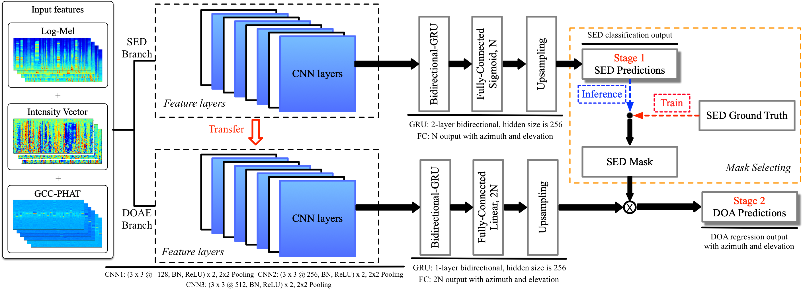

# DCASE2019 task 3
Our DCASE 2019 task 3 code.

This code is our final challenge code for DCASE 2019 Task 3. In this method, a two-stage polyphonic sound event detection and localization method using log mel, intensity vector and generalized cross-correlation (GCC) features is proposed. For more information of this task, please refer to http://dcase.community/challenge2019/task-sound-event-localization-and-detection.

This repository can be cloned using:
```shell
git clone https://github.com/yinkalario/DCASE2019-TASK3
```

## Citation

The code in this repo is easy to understand and implement. If you use our codes in any format, please consider citing the following paper:

```
@techreport{Cao2019,
    Author = "Cao, Yin and Iqbal, Turab and Kong, Qiuqiang and Galindo, Miguel and Wang, Wenwu and Plumbley, Mark",
    institution = "DCASE2019 Challenge",
    title = "TWO-STAGE SOUND EVENT LOCALIZATION AND DETECTION USING INTENSITY VECTOR AND GENERALIZED CROSS-CORRELATION",
    month = "June",
    year = "2019"
}
```

Paper URL: http://dcase.community/documents/challenge2019/technical_reports/DCASE2019_Cao_74.pdf

You could also check our previous code on: https://github.com/yinkalario/Two-Stage-Polyphonic-Sound-Event-Detection-and-Localization

## Dataset

The dataset can be downloaded from http://dcase.community/challenge2019/task-sound-event-localization-and-detection. This dataset contains 400 audio recordings splitted into 4 folds. Two formats of audios are givin: 1) First-Order of Ambisonics; 2) tetrahedral microphone array. There are 11 kinds of isolated sound events in total. The audio recordings are mixtures of isolated sound events and natural ambient noise. The sound events, which have a polyphony of up to two, are convolved with impulse responses collected from five indoor locations.

## The method

The input features used are log mel, intensity vector in mel space and GCC-PHAT spectrograms. Log mel is used for sound event detection, while intensity vector in mel space and GCC-PHAT spectrograms are used for DOA estimation.

### Network Architecture



### Stacking ensemble method

*Stacking* is an ensemble method in which the ensemble function is learned using a machine learning algorithm. This allows exploiting the characteristics of the models, such as class-wise performance, in a data-driven manner. In our system, a convolutional recurrent neural network with three layers was used to model the ensemble function.

## Using codes

The codes in this repo are fully reproducible. It only depends on the seed. With the seed unchanged, the results will be exactly the same for every run. Please also refer to the requirements_pip.yaml and requirements_conda.yaml, which list the corresponding packages.

### 0. Prepare data

Download and upzip the data, the data looks like:

<pre>
dataset_root
├──dev
│   ├── metadata_dev (400 files)
│   │    ├── split1_ir0_ov1_0.csv
│   │    └── ...
│   ├── foa_dev (400 files)
│   │    ├── split1_ir0_ov1_0.wav
│   │    └── ...
│   ├── mic_dev (400 files)
│   │    ├── split1_ir0_ov1_0.wav
│   │    └── ...
│   └── ...
└── eval
    ├── foa_dev (100 files)
    │    ├── split0_1.wav
    │    └── ...
    └── mic_dev (100 files)
         ├── split0_1.wav
         └── ...
    
</pre>

### 1. Requirements

python 3.6 + pytorch 1.0

### 2. Other codes may be helpful
Before proceeding, it should be noted that this version is a bit complicated and is only used for the challenge. It is also recommended to check our previous code, which is easier to understand, on https://github.com/yinkalario/Two-Stage-Polyphonic-Sound-Event-Detection-and-Localization 

### 3. Run the codes

I. Set your own directories in all .sh files:

II. Extract features:

```shell
./bash/1_extract_features.sh
```

III. train a model:

```shell
./bash/2_train.sh
```

Models will be saved starting from 38 epoch for SED, and from 78 epoch for DOA estimation. These parameters can be adjusted in ./main/main.py

IV. Evaluation inference:

```shell
./bash/3_eval_inference.sh
```

V. Cross validation

This step is optional. It is used to cross validate the development set.

Simply run

```shell
./bash/optional_cross_validation.sh
```

VI. stacking ensemble:

This step is optional. All of the stacking codes are in ./stacking/ folder.

In order to use this stacking, one should:

- Extract SED prediction files from ./appendixes/submissions_eval/$MODEL_FOLDER/sed_mask_fusioned/, and copy those files to a folder named 'model_1' eg., this 'model_1' folder should be placed under a path specified as DEV_MODELS_PATH or EVAL_MODELS_PATH in ./stacking/run.sh

- In this code, up to four models are stacking fusioned, so if you try to use stacking, four folders which are 'model_1', 'model_2', 'model_3' and 'model_4' should be created and filled in with the data extracted from four models. More models could be used for ensemble, simply modify the list 'MODEL' in ./stacking/meta_features.py

then run

```shell
./stacking/run.sh
```

then copy the generated ensemble files to ./appendixes/submissions_eval/models_ensemble/sed_mask_models_fusioned/

then run

```shell
./bash/optional_after_stacking.sh
```

### 4. Training and evaluation
The training of mini-batch size of 32 takes 210ms / batch on a single GTX 1080 Ti GPU. If you have GPU memory error, try to reduce the batch size. 

### 5. Summary
This repository is our code for DCASE 2019 Task 3. Please let us know if you have problems with the codes.

## License
File metrics/cls_feature_class.py and metrics/evaluation_metrics.py are under TUT_LICENSE. 

All other files are under MIT_LICENSE. 

## External link

[1] http://dcase.community/challenge2019/task-sound-event-localization-and-detection

[2] https://github.com/sharathadavanne/seld-dcase2019
